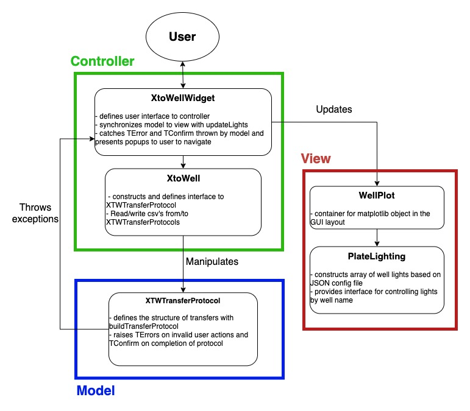

# WellLit

Template library for developing WellLit applications. This library is instantiated in two repos, (TubeToWell)[https://github.com/czbiohub/WellLit-TubeToWell] and (WelltoWell)[https://github.com/czbiohub/WellLit-WelltoWell]

The following diagram describes the overall class structure for both TubetoWell and WelltoWell repos. The design pattern follows the Model-View-Controller schema, where the underlying model is a TransferProtocol uniquely defined by the application. Both repos can be configured to a 96- or 384- well format by changing options in a WellLitConfig.json file located in the repos.  The position and size of the well lights can also be configured in the same JSON file to adapt to different screens or plate layouts. Records are by default written to the [repo]/records directory unless specified otherwise by the user in the JSON file. 

